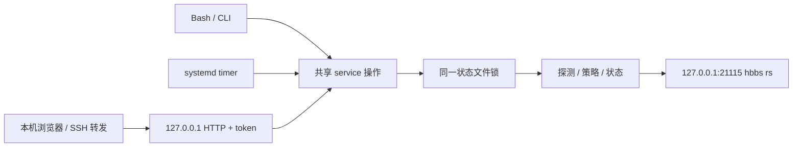

# 本机 WebUI 试验方案

状态：2026-09-30，`feature/local-token-webui` 分支。对第一版“暂不启动 Web”边界做显式扩展；relay 策略、hbbs 接口及现场验收要求继续遵守 [方案与技术选型](方案与技术选型.md)。

## 定位与分层

面向个人自用的 RustDesk OSS 管理器。`config.py` 校验配置，`policy.py` 负责纯策略，`io.py` 访问网络与文件，`service.py` 的 `operate` 提供共享命令语义。CLI、Bash、timer 和 WebUI 复用这些后端能力；WebUI 不通过 shell 拼命令，也不重新实现选 relay 的策略。



WebUI 是可选独立常驻进程。仅启动 WebUI 不会周期性探测或切换，也不会启用 timer。查看页面时进行一次只读 `status`，后续由用户刷新。

## 访问方式与防护

- 固定绑定 IPv4 `127.0.0.1`，没有更改监听地址的选项；默认端口 `8765`。必须与 hbbs 共享网络命名空间。
- 入口为 `http://127.0.0.1:8765/?token=<token>`。裸地址、错误 token、重复 token 返回 401，不返回页面。token 用恒定时间比较。
- 首次启动生成 256 位随机 token，默认保存于状态目录的 `webui.token`，文件归当前用户所有且权限必须为 `0600`。已有文件不能是符号链接；重启沿用 token。可通过 `--token-file` 指定路径。
- 页面立即用 `history.replaceState` 清除 URL 中的 token，在页面内存中持有 token，API 仅接受 `Authorization: Bearer <token>`。不使用 cookie、localStorage 或 sessionStorage；页面刷新后须重新打开带 token 的入口链接。
- 本机或 SSH 转发都允许 `127.0.0.1:<端口>` / `localhost:<端口>` Host，拒绝其他域名以限制 DNS rebinding。存在 Origin 时要求与 Host 同源，拒绝跨站 Fetch Metadata。没有 CORS 放行。写入仅接受带 bearer 的 JSON POST。
- 页面没有外部字体、脚本、图片或 CDN。响应设置 `no-store`、`no-referrer`、禁止 iframe，并使用带随机 nonce 的 CSP。服务不记录请求 URL；完整入口地址仅在交互终端输出，systemd journal 只输出监听地址和 token 文件位置。
- token 持有人可以执行所有管理操作，没有账户或权限分级。停止 WebUI、删除 token 文件后重启，可以使旧 token 失效；运行中直接改文件不会轮换内存中的 token。

token 入口链接本身是凭据，应保存在个人密码管理器中。浏览器扩展、SSH 终端记录及持有文件读取权限的本机用户仍可能取得它。URL 清理和应用日志处理降低泄露机会，但不能保证浏览器历史或终端录制从未记录入口链接。若通过隧道访问，保留 SSH 的身份认证与加密；本方案不用于公网或局域网直接开放 HTTP。

## 首版功能与接口

| 接口 | 行为 |
| --- | --- |
| `GET /?token=...` | 鉴权后加载管理页面。 |
| `GET /api/status` | 回读实际 relay，展示模式、目标、原因、节点健康与 RTT，不探测、不写 relay。 |
| `GET /api/nodes` | 配置与已有探测状态，不联系 hbbs。 |
| `POST /api/probe`，`{}` | 探测并持久化计数，不读写 hbbs。 |
| `POST /api/switch`，`{"id":"usla"}` | 与 CLI 相同：先探测，再检查健康、保存手动意图、应用并独立回读。 |
| `POST /api/auto`，`{}` | 与 CLI 相同：探测、恢复自动模式、立即决策。 |
| `GET /api/config` | 返回当前 INI 文本及 SHA-256 内容版本。 |
| `POST /api/config`，`{"text":"...","revision":"..."}` | 加锁、检查版本、使用现有规则校验，备份旧内容并原子替换。 |

所有 `/api/*` 都必须携带 bearer，包括只读配置。配置读写、状态命令、CLI 和 timer 共用 `<state>.lock`，冲突返回 409。hbbs 回读或写后确认失败返回 502，并带当前快照；实际 relay 显示未确认，手动意图仍保存供后续重试。

配置保存保留原文件权限与属主，旧内容写至 `<config>.webui.bak`（保留最近一版）。无效配置或旧 revision 不覆盖原文件。手动模式下，不允许删除、禁用或更改固定节点地址，须先恢复自动模式。WebUI 不支持编辑符号链接配置。

页面可以预览按行对比；保存后下次操作或现有 timer 会读取新配置，可能影响后续选择。修改 `probe_interval_seconds` 不会修改 systemd timer，仍须在终端同步配置。编辑器没有账号管理、Docker 控制、timer 开关或日志数据库；事件仍用 CLI `history` 查看。

## 启动与 SSH 访问

开发试运行（示例地址仅用于展示，不要探测或切换占位地址）：

```bash
python3 -m relay_helper --config config/relay-helper.example.ini --state var/state.json web --port 8765
```

交互终端打印完整访问地址。没有 hbbs 时页面会显示实际 relay 未确认，仍可查看节点及配置；配置保存会修改所选文件，开发时推荐先复制为已忽略的 `config/local.ini`。

已安装到系统目录时：

```bash
sudo rustdesk-relay-helper web --port 8765
```

可选安装 WebUI service（独立于自动选择 timer）：

```bash
sudo install -m 0644 deploy/systemd/rustdesk-relay-helper-web.service /etc/systemd/system/
sudo systemctl daemon-reload
sudo systemctl enable --now rustdesk-relay-helper-web.service
```

在个人电脑建立 SSH 转发，并保持该终端运行：

```bash
ssh -N -L 127.0.0.1:8765:127.0.0.1:8765 user@server
```

从服务器读取 token 文件，随后在个人电脑浏览器打开 `http://127.0.0.1:8765/?token=<文件内容>`：

```bash
sudo cat /var/lib/rustdesk-relay-helper/webui.token
```

客户端 `8765` 被占用时，改转发左侧端口，例如 `127.0.0.1:9876:127.0.0.1:8765`，浏览器使用 `9876`。转发监听地址也应固定为 `127.0.0.1`。

停止使用 `sudo systemctl stop rustdesk-relay-helper-web.service`。轮换 token 时，先停止服务、删除默认 token 文件、再启动；所有已打开页面的旧 token 随重启失效。配置回滚时先暂停 timer，再在终端将 `.webui.bak` 恢复到配置路径，验证后按需恢复 timer。

## 验证边界

单元与本地 HTTP 测试覆盖裸入口拒绝、入口 token 与 API bearer、Host / Origin / Fetch Metadata、防 URL 日志泄露、写入格式与大小限制、锁互斥、手动意图持久化、hbbs 失败显示未确认、配置校验与版本冲突、备份和 token 文件权限。真实 RustDesk 会话、部署机权限和 systemd 实际运行继续需要现场验收。

本分支已通过 59 项测试、Bash / JavaScript 语法与 systemd 单元校验。使用本机 Chromium 和模拟 hbbs 后端验证了入口保护、URL 清理、节点按钮状态、探测、切换与模式持久化、配置预览与保存、页面刷新后的重新鉴权，以及桌面和移动端布局；未在此环境启动系统级 systemd 服务。
