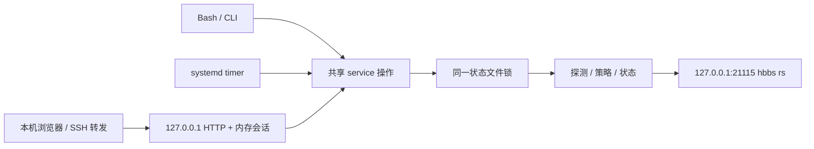

# 本机 WebUI 试验方案

状态：2026-09-30，`feature/local-token-webui` 分支。对第一版“暂不启动 Web”边界做显式扩展；relay 策略、hbbs 接口及现场验收要求继续遵守 [方案与技术选型](方案与技术选型.md)。

2026-10-01 扩展：配置编辑增加 GUI 表单与 INI 文本的双向映射，继续使用同一个保存接口、版本检查和后端校验。

2026-10-02 扩展：`feature/web-login-persistence` 实现[登录持久化](./Web登录持久化设计.md)，以进程内会话和 HttpOnly Cookie 解决刷新丢失登录；Web 服务重启后会话全部失效。本文访问合同已同步更新。

## 定位与分层

面向个人自用的 RustDesk OSS 管理器。`config.py` 校验配置，`policy.py` 负责纯策略，`io.py` 访问网络与文件，`service.py` 的 `operate` 提供共享命令语义。CLI、Bash、timer 和 WebUI 复用这些后端能力；WebUI 不通过 shell 拼命令，也不重新实现选 relay 的策略。



WebUI 是可选独立常驻进程。仅启动 WebUI 不会周期性探测或切换，也不会启用 timer。查看页面时进行一次只读 `status`，后续由用户刷新。

## 访问方式与防护

- 固定绑定 IPv4 `127.0.0.1`，没有更改监听地址的选项；默认端口 `8765`。必须与 hbbs 共享网络命名空间。
- 入口为 `http://127.0.0.1:8765/`。未登录只返回登录页，有有效会话才返回管理页面。原有 `/?token=<token>` 仅返回登录确认页，不自动建立会话；错误、空值、重复 token 和额外参数返回 401。token 用恒定时间比较。
- 首次启动生成 256 位随机 token，默认保存于状态目录的 `webui.token`，文件归当前用户所有且权限必须为 `0600`。先在同目录临时文件中完整写入并同步，再用硬链接原子发布且不覆盖并发创建的 token，最后同步目录；发布前中断不会留下空或截断的目标文件。已有文件不能是符号链接；重启沿用 token。可通过 `--token-file` 指定路径。
- 登录 POST 使用原始 Bearer 和 `{"remember":false}`；成功后清除输入，以随机会话 ID 的 `HttpOnly; SameSite=Strict; Path=/` host-only Cookie 鉴权。管理 API 不接受原始 Bearer 回退；不使用 localStorage 或 sessionStorage。旧链接立即清理 URL，显式登录后正常刷新保持会话。
- 普通会话最长 8 小时，Cookie 不设保存期限；可选记住登录设置 7 天 Max-Age。服务端使用单调时钟固定到期，不续期。会话仅在内存，服务重启全部失效；退出撤销当前会话并清除 Cookie。失效时管理接口返回 401，前端保留配置草稿，重新登录不自动重放操作。
- 本机或 SSH 转发都允许 `127.0.0.1:<端口>` / `localhost:<端口>` Host，拒绝其他域名和非法端口以限制 DNS rebinding。GET 的 Origin 可缺失；登录、退出与所有 JSON POST 必须具有唯一同源 Origin，业务 POST 另须会话绑定的 X-CSRF-Token。拒绝跨站与同站不同源 Fetch Metadata，没有 CORS 放行。会话绑定主机名与本地端口，更换入口需重新登录。
- 单实例最多 128 个有效会话，容量满时拒绝新增，不踢出其他浏览器；同源重新登录替换当前会话。全实例 60 秒内 5 次失败后，登录交换返回 429，待窗口恢复。不同实例的 Cookie 名称按 token 和服务监听端口区分。
- 页面没有外部字体、脚本、图片或 CDN。响应设置 `no-store`、`no-referrer`、禁止 iframe，并使用带随机 nonce 的 CSP。服务不记录请求 URL；完整入口地址仅在交互终端输出，systemd journal 只输出监听地址和 token 文件位置。
- token 持有人可以执行所有管理操作，没有账户或权限分级。停止 WebUI、删除 token 文件后重启，可以使旧 token 失效；运行中直接改文件不会轮换内存中的 token。

原始 token 和兼容入口链接都是凭据，应保存在个人密码管理器中。浏览器扩展、SSH 终端记录及持有文件读取权限的本机用户仍可能取得它。URL 清理和应用日志处理降低泄露机会，但不能保证浏览器历史或终端录制从未记录入口链接。访问仅通过 SSH 隧道提供，保留 SSH 的身份认证与加密；本方案不用于公网或局域网直接开放 HTTP。回环 HTTP 不设置 Secure，也不使用依赖 Secure 的 __Host- 前缀。Cookie 不按端口隔离，避免在同一主机名运行不可信 HTTP 服务；来源绑定不能防止其他服务收到 Cookie。

## 首版功能与接口

| 接口 | 行为 |
| --- | --- |
| `GET /` | 有有效会话时加载管理页面，否则只加载登录页。 |
| `GET /?token=...` | 校验唯一正确 token 后加载登录确认页，不创建会话。 |
| `POST /api/session/login`，`{"remember":false}` | 同源 JSON POST 与唯一原始 Bearer 换取新会话，返回 CSRF 与到期信息，设置 Cookie。 |
| `GET /api/session` | 有有效 Cookie 会话时返回登录状态与 CSRF，不返回原始 token 或会话 ID。 |
| `POST /api/session/logout`，`{}` | 校验 Cookie、Origin、CSRF，撤销当前会话并清除 Cookie。 |
| `GET /api/status` | 回读实际 relay，展示模式、目标、原因、节点健康与 RTT，不探测、不写 relay。 |
| `GET /api/nodes` | 配置与已有探测状态，不联系 hbbs。 |
| `POST /api/probe`，`{}` | 探测并持久化计数，不读写 hbbs。 |
| `POST /api/switch`，`{"id":"usla"}` | 与 CLI 相同：只对目标进行双次探测，要求本轮成功且健康，再保存手动意图、应用并独立回读。 |
| `POST /api/auto`，`{}` | 与 CLI 相同：探测、恢复自动模式、立即决策。 |
| `GET /api/config` | 返回当前 INI 文本及 SHA-256 内容版本。 |
| `POST /api/config/parse`，`{"text":"..."}` | 使用现有解析器，将 INI 草稿映射为带默认值的策略与节点表单数据；不读取或修改磁盘。 |
| `POST /api/config/render`，`{"text":"...","model":{...}}` | 校验表单并映射回 INI 草稿，保留现有配置节的注释与未修改字段；不保存。 |
| `POST /api/config`，`{"text":"...","revision":"..."}` | 加锁、检查版本、使用现有规则校验，备份旧内容并原子替换。 |

除登录交换外，所有 `/api/*` 都需有效 Cookie 会话，包括只读配置；JSON POST 另需同源 Origin 与 CSRF。接口不接受查询参数。配置读写、状态命令、CLI 和 timer 共用 `<state>.lock`，冲突返回 409。hbbs 回读或写后确认失败返回 502，并带当前快照；实际 relay 显示未确认，手动意图仍保存供后续重试。

配置保存保留原文件权限与属主，旧内容写至 `<config>.webui.bak`（保留最近一版）。无效配置或旧 revision 不覆盖原文件。手动模式下，不允许删除、禁用或更改固定节点地址，须先恢复自动模式。WebUI 不支持编辑符号链接配置。

页面可以预览按行对比；保存后下次操作或现有 timer 会读取新配置，可能影响后续选择。修改 `probe_interval_seconds` 不会修改 systemd timer，仍须在终端同步配置。编辑器没有账号管理、Docker 控制、timer 开关或日志数据库；事件仍用 CLI `history` 查看。

## GUI 与 INI 编辑

展开“节点与策略配置”后，默认载入 GUI 表单。策略区包含七个参数的数字输入、单位和用途说明；节点区包含 ID、relay 地址、优先层级、启用与 RTT 排名开关。节点可添加、移除、上移和下移，至少保留一个节点。顺序对同层不参加 RTT 排名的兜底节点有实际意义。

GUI → INI：切换到文本、查看修改或保存时，将表单投射到当前 INI 草稿。由后端 `config.py` 校验数字、ID、地址及重复项，不在浏览器重写 INI 解析规则。未修改的字段、已有配置节内的注释和省略的默认参数保留；没有实际改变时返回原文。新增或改名节点生成新的配置节，移除节点会去掉旧节，最终变化可以在保存前预览。

INI → GUI：切换到表单时解析当前文本草稿，含省略的默认值及 INI 支持的布尔值别名。非法草稿保留在文本模式，并显示错误，不替换为旧表单内容。表单的非法输入也不会覆盖 INI 草稿。切换模式、增删节点和预览仅修改浏览器草稿，不修改服务器文件或 hbbs。

两个编辑入口共享载入时取得的 revision。最终保存仍需确认，后端使用已有文件锁、版本检查、配置校验、手动目标保护和备份。重新载入遇到未保存修改时先提示放弃草稿。

## 启动与 SSH 访问

开发试运行（示例地址仅用于展示，不要探测或切换占位地址）：

```bash
python3 -m relay_helper --config config/relay-helper.example.ini --state var/state.json web --port 8765
```

交互终端打印完整访问地址。没有 hbbs 时页面会显示实际 relay 未确认，仍可查看节点及配置；配置保存会修改所选文件，开发时推荐先复制为已忽略的 `config/local.ini`。

已安装到系统目录时：

```bash
sudo rustdesk-relay-helper web --port 8765
```

可选安装 WebUI service（独立于自动选择 timer）：

```bash
sudo install -m 0644 deploy/systemd/rustdesk-relay-helper-web.service /etc/systemd/system/
sudo systemctl daemon-reload
sudo systemctl enable --now rustdesk-relay-helper-web.service
```

在个人电脑建立 SSH 转发，并保持该终端运行：

```bash
ssh -N -L 127.0.0.1:8765:127.0.0.1:8765 user@server
```

从服务器读取 token 文件，随后在个人电脑浏览器打开 `http://127.0.0.1:8765/`，输入 token 并显式登录：

```bash
sudo cat /var/lib/rustdesk-relay-helper/webui.token
```

客户端 `8765` 被占用时，改转发左侧端口，例如 `127.0.0.1:9876:127.0.0.1:8765`，浏览器使用 `9876`。转发监听地址也应固定为 `127.0.0.1`。

停止使用 `sudo systemctl stop rustdesk-relay-helper-web.service`。普通重启保留原始 token 文件，但全部浏览器会话失效。轮换 token 时，先停止服务、删除默认 token 文件、再启动；旧 token 无法登录，旧会话同样失效。运行中直接修改文件不轮换内存 token。配置回滚时先暂停 timer，再在终端将 `.webui.bak` 恢复到配置路径，验证后按需恢复 timer。

## 验证边界

单元与本地 HTTP 测试覆盖公开登录页不调用后端、登录确认、会话 Cookie、固定期限、重启失效、退出重放、来源绑定、Host / Origin / Fetch Metadata / CSRF、重复请求头、并发与容量、失败登录限速、防 URL 日志泄露、写入格式与大小限制，以及原有业务锁、备份、配置和 token 文件合同。真实 SSH 隧道、RustDesk 会话、部署机权限和 systemd 实际运行继续需要现场验收。

回归命令为 `python -m unittest discover -s tests -v`。可选浏览器回归为 `python tests/browser_login.py`，需开发环境已安装 Playwright 与 Chromium；生产运行不需要这些依赖。浏览器回归使用临时配置和模拟 hbbs，验证登录确认、刷新、跨标签页退出、记住登录与 Web 服务重启，以及 GUI / INI 草稿在重启失效后保留、重新登录不重放操作、再次确认保存。缺少浏览器依赖时会显式跳过，不能视为浏览器验证成功。
