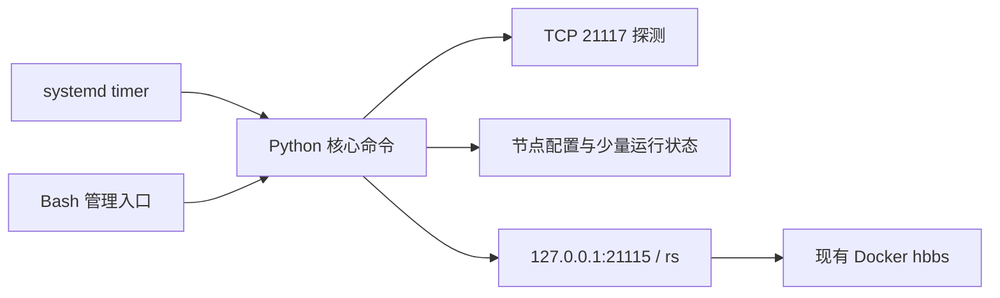

# RustDesk OSS Relay 管理器：方案与技术选型

状态：设计稿（2026-09-27）。本文只定义第一版目标与接口，不表示已在生产环境部署或验证切换。

2026-09-30 扩展：本机 token WebUI 在独立分支试验，见 [WebUI 方案](WebUI方案.md)。下文“不启动 Web / 不做在线编辑器”描述原始第一版范围；新方案扩展入口与配置编辑，继续遵守本文件的 relay 策略合同。

## 1. 背景与目标

现有拓扑来自[前序对话](chatgpt-conversation://6ab8c63a-02bc-83e8-8468-fcb8fc10d025)：CNHZ 运行官方 OSS `hbbs` 和本地 `hbbr`，USLA 的 `hbbr` 为优先使用节点，未来可能加入普通备用节点。当前部署可以把 CNHZ 配置为本地容灾节点，但策略本身不识别或固定任何“最后一级”节点；每个节点都由静态层级和是否参与 RTT 排名共同决定选择顺序。

第一版在 CNHZ 宿主机管理 relay 节点，定时从该宿主机连接各节点的 TCP `21117`，根据静态层级、健康状态和 RTT 选择一个 relay，并通过 `hbbs` 运行时控制台更新。管理员在 Bash 终端查看状态、手动固定节点或恢复自动模式。未来的 Web 界面可以调用同一套核心操作，但本版不启动 Web 服务。

本工具只管理 **`hbbs` 下发的 `hbbr` 地址**。它不负责多个 `hbbs` 的高可用、不接管客户端的 ID Server 配置，也不保证已有会话无感迁移。只有需要中继、且客户端没有另行固定 Relay Server 的连接才会受到本设计控制；这项实际行为应在上线验收时核对。[官方客户端配置说明](https://rustdesk.com/docs/en/self-host/client-configuration/)允许客户端的 Relay Server 留空。

## 2. 已知环境与证据边界

| 项目 | 前序对话中的证据 | 当前结论 |
| --- | --- | --- |
| `hbbs` | `docker inspect` 显示 `rustdesk/rustdesk-server` 1.1.15、`Cmd: ["hbbs"]`、`network: host`、`/root/data:/root`、`unless-stopped` | 这是此前提供的配置快照，尚未对生产机重新读取。 |
| Relay 启动值 | 快照无 `-r`，环境变量未见 relay 设置 | 当时没有显式 relay；不能据此认定现在的运行时列表仍为空。 |
| 控制台能力 | 用户贴出的 `h` 帮助包含 `relay-servers(rs) <separated by ,>` | 已证实该实例识别 `rs` 命令；**尚未取得只读 `rs` 实际输出，也未验证写入后的客户端效果**。 |
| Relay 节点 | USLA 主用、CNHZ 兜底；备用节点尚未确定 | 示例地址均为占位符，不得直接用于部署。 |

[1.1.15 源码](https://raw.githubusercontent.com/rustdesk/rustdesk-server/1.1.15/src/rendezvous_server.rs)显示：`rs` 不带参数读取当前列表；`rs <地址>` 发送异步更新消息；若列表中有多个节点，`get_relay_server` 轮转选取。因此第一版每次只向 `hbbs` 写入一个地址，策略由管理器执行。源码还表明 `21115/TCP` 上的控制命令只对来自 loopback 的连接执行；管理器应运行在与 `hbbs` 共享网络命名空间的 CNHZ 宿主机，并固定连接 `127.0.0.1:21115`。`21115` 同时承担正常 NAT 测试功能，不能把整个端口当作私有管理端口。[官方端口文档](https://rustdesk.com/docs/en/self-host/rustdesk-server-oss/docker/)列出 `21115/TCP`、`21116/TCP+UDP` 与 `21117/TCP` 的用途。

## 3. 组件与技术选型



| 决策 | 第一版选型 | 原因与范围 |
| --- | --- | --- |
| 部署位置 | CNHZ Linux 宿主机上的独立程序 | 可直连 `127.0.0.1:21115`，不改现有 `hbbs` 镜像，也不需要 Docker socket。裸机运行 `hbbs` 时同样适用。 |
| 主体实现 | Python 3 标准库 | `socket` 能准确计时 TCP connect，配置/状态与命令解析比纯 Bash 容易维护；目标机 Python 版本待确认。 |
| 终端入口 | Bash 薄入口 + Python 子命令 | 满足 Bash 控制台使用方式；Bash 只负责命令分发/展示，不复制决策逻辑。无需交互式菜单。 |
| 定时执行 | `systemd` oneshot service + timer，建议每 20 秒一次 | 少量节点不需要常驻服务。手动命令与定时执行共用一把本地文件锁，避免同时修改状态和 `hbbs`。 |
| 人工配置 | INI，使用 Python `configparser` | 目标机 Python 版本未知；INI 可用标准库解析，避免为 YAML/TOML 添加依赖或版本前提。 |
| 运行状态 | 一个小型 JSON 文件 | 保存手动/自动模式、连续探测计数、用于排名的近期 RTT 样本、上次切换时间与已确认的目标；不会把长期探测历史存为数据库。状态写入采用临时文件替换，避免中断时留下半个 JSON。 |
| 事件查看 | 定时和手动命令以相同标识写入 systemd journal；CLI `history` 按该标识读取最近事件 | 只保留与切换、错误有关的运行记录，不为第一版另建审计库。 |
| `hbbs` 接口 | 1.1.15 运行时 `rs` | 写后用新连接回读 `rs`，只在读到唯一目标时报告成功。命令返回空字符串不等于写入成功。 |

当前 `docker run hbbs` 不需要改成 Compose。管理器的初版不提供容器重建适配器；若现场 `rs` 写入验收失败，应先停止自动写入并重新评估接口，而不是给程序 Docker 控制权限。Docker 重启不会保存运行时 `rs` 设置，因此管理器恢复运行后要重新读取并应用自己的目标。[官方配置参考](https://github.com/rustdesk/rustdesk-server/blob/master/docs/environment-variables.md)说明 `-r`/`RELAY-SERVERS` 是启动配置；具体运行时行为以 1.1.15 源码及现场验证为准。

## 4. 配置与策略合同

建议配置形态（示例地址必须替换）：

```ini
[policy]
probe_interval_seconds = 20
connect_timeout_seconds = 2
fail_after = 3
recover_after = 6
minimum_hold_seconds = 300
rtt_sample_count = 5
rtt_switch_margin_ms = 20

[node:usla]
address = usla.example.com:21117
tier = 10
enabled = true
rtt_ranked = true

[node:backup]
address = backup.example.com:21117
tier = 20
enabled = true
rtt_ranked = true

[node:cnhz]
address = cnhz.example.com:21117
tier = 100
enabled = true
rtt_ranked = false
```

- `tier` 数字越小优先级越高，是不可被 RTT 跨越的硬边界。节点可配置在任意层级；CNHZ 在示例中位于 `tier = 100` 只是当前部署选择，不是策略约束。
- `rtt_ranked` 表示节点是否参加同一 `tier` 内的 RTT 自动排名，未配置时默认为 `true`。设为 `false` 的节点仍会被自动故障切换选中并继续接受健康探测，只是不参与 RTT 比较；管理器在该层没有健康的 RTT 排名节点时，按配置顺序检查这些纯优先级节点，再进入下一层。
- 同一层参与排名的健康节点使用最近 `rtt_sample_count` 次成功 TCP 建连耗时的中位数作为有效 RTT。节点同时达到健康条件并积累满所需样本后才进入 RTT 排名；单次探测值只用于展示，不直接触发切换。
- 每次探测记录成功/失败、耗时、时间和探测源（CNHZ）。TCP connect 成功仅表示 **CNHZ → relay:21117** 可达，不表示协议握手、两端客户端或其他网络可用。
- 连续失败 3 次才将节点判为不可用；连续成功 6 次才判为恢复。初次启动时节点状态为未知，积累足够成功结果前不主动覆盖现有 `hbbs` 配置。
- 当前节点失效后，从已判健康的节点中按 `tier`、RTT 排名池、纯优先级节点的顺序选择；故障切换不受 300 秒保持期约束。向更高优先级节点切回时，既要恢复满 6 次，也要距上次成功切换满 300 秒。
- 当前节点与候选节点都参与 RTT 排名且仍健康时，只有候选节点的有效 RTT 至少低 `rtt_switch_margin_ms`，且保持期已满，才允许因 RTT 主动切换。当前节点是同层纯优先级兜底时，RTT 排名池中的节点恢复并满足保持期后优先回切，不比较两者 RTT。跨 `tier` 的恢复回切只看层级和恢复阈值，不用 RTT 抵消业务优先级。
- 若所有节点均不健康或未知，不写入空列表，也不假称本地兜底成功；保留 `hbbs` 当前值，并显示“无已验证可用节点”。
- 手动 `switch <id>` 固定目标，需该节点最近状态健康；手动模式下不自动换节点，但继续探测与提示故障。`auto` 恢复自动决策。手动模式在重启后保留。
- 每次准备写入前，再读取 `hbbs` 实际列表；相同则不写。空列表只在 TCP 请求正常完成、连接正常关闭且未返回内容时才成立，连接失败或超时不能解释为空列表。写入后轮询回读，直到读到唯一目标或超时。回读失败时标记“实际状态未确认”，不更新上次成功切换时间；下一周期先重新读取再决策。

## 5. 命令边界与后续扩展

第一版 CLI：`status`（模式、实际 relay、目标、选择原因、探测源与时间）、`nodes`（启用状态、tier、是否参与 RTT 排名、最近探测和有效 RTT）、`probe`（立即探测但不切换）、`switch <id>`、`auto`、`history`。定时任务调用内部 `reconcile`。节点增删先编辑 INI，由下次运行读取；不做在线编辑器。

将“读/写 `hbbs`、探测、策略、状态”写成可直接调用的 Python 函数，Bash 入口只调用子命令。未来需要 Web 时，在这些操作前加 HTTP 层；本阶段不定义账号、Web API 或数据库。

`hbbs` 健康和多 ID Server 故障切换属于另一个问题。官方文档指出客户端注册/心跳使用 `21116/UDP`，因此不能用 relay 的 TCP `21117` 结果代表 `hbbs` 健康；外部设备视角的探针也应另行规划。[官方 Docker 端口说明](https://rustdesk.com/docs/en/self-host/rustdesk-server-oss/docker/)

## 6. 现场待确认

1. 在 CNHZ 宿主机只读执行 `printf 'rs' | nc -w 2 127.0.0.1 21115`，保存实际输出；确认目标机 Python、systemd、`nc` 是否可用。
2. 确认 USLA、备用、CNHZ 的真实公网地址、端口和 `hbbr` 工作状态，以及受控端、控制端是否将 Relay Server 留空。
3. 首次写入前，确定真实客户端验证窗口：分别验证 USLA、备用、CNHZ 两端强制经中继建立新会话；观察切换对已有会话的影响。
4. 核对 1.1.15 现场镜像与预期版本；未来升级后重新验证 `rs` 行为。

这些是实施前的输入与验收项，不是本文已完成的生产验证。
